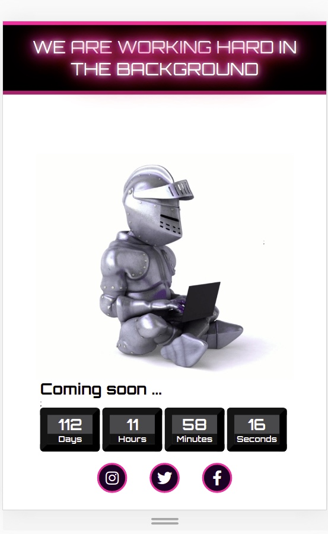

## Coming soon

This project was created to practice responsive design.
Landing page coming soon with video background and counter.

**Build with:**

&nbsp;

&nbsp;

&nbsp;
&nbsp;

&nbsp;

&nbsp;

[Live Demo](https://mandyneumeyer.github.io/coming_soon/)

